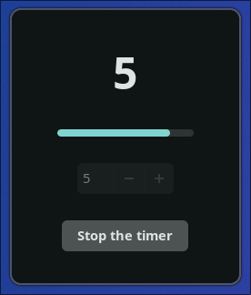

# timezz
A minimal GTK4 application written in rust for creating productivity sessions, inspired by Windows' focus sessions.

# Features
- Timer from 5 to 300 minutes
- Progressbar that represents how much time is left
- Sends a notification when a timed session ends

# Images

# Todo
- [ ] Configuration options
- [ ] Snapping to screen edges (maybe also minimizing to tray)
- [ ] Sound after finishing a session
